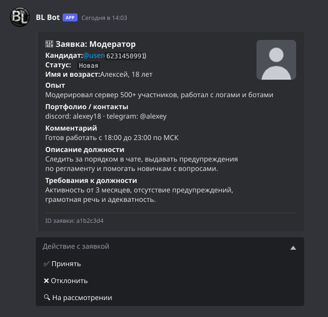
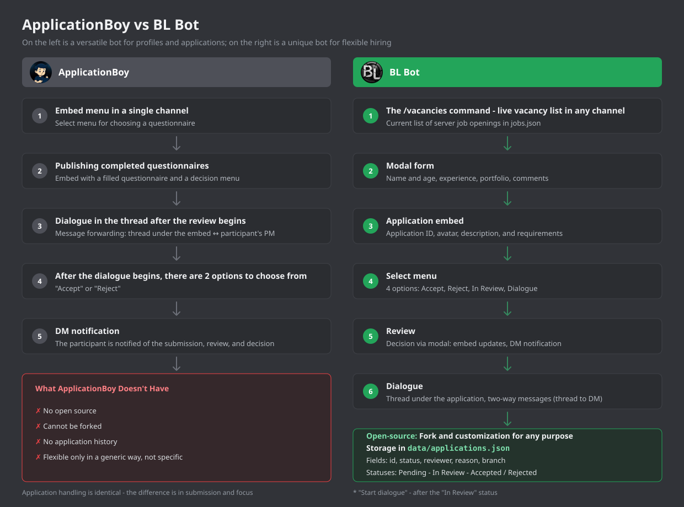

<div align="center">

# BL-Bot

### ApplicationBoy alternative



A Python Discord bot developed as an open-source alternative to ApplicationBoy.

</div>

---

## Overview



**BL Bot** posts vacancies as embeds in any channel, accepts applications
through modals, and lets staff review candidates (accept / reject / request
info / start a dialogue) right under the vacancy message. Candidate and
reviewer can talk in a thread that is mirrored to the candidate's DMs.

## Commands

| Command | Who | Description |
| --- | --- | --- |
| `/vacancies` | everyone | List open vacancies and apply |
| `/idea` | everyone | Submit an idea for review |
| `/post` | `ROLE_NEWS` | Publish a news embed to the current channel |
| `/vacancy add` | `ROLE_JOBS_MANAGE` | Add a vacancy (staged, not published) |
| `/vacancy del` | `ROLE_JOBS_MANAGE` | Remove a vacancy |
| `/lang` | everyone | Show or switch the bot language (en / ru) |

## Languages

The bot interface is available in **English** (default) and **Russian**.
Each user picks their own language with `/lang`; the choice is saved per user.
Slash command descriptions are always English (Discord shows them before
the bot can reply). English UI strings and the SVG mockups in this README
were produced by machine translation (DeepL) and manually reviewed.

## Tech Stack

- Python 3.10+
- [discord.py](https://github.com/Rapptz/discord.py) 2.x (app commands, UI kits)
- python-dotenv
- JSON files as storage (`data/`, git-ignored - created automatically)

No database, no external services.

## Setup

1. Clone the repository and create a virtual environment:

   ```bash
   git clone https://github.com/xeraze/BL-Bot.git
   cd BL-Bot
   python -m venv .venv
   .venv\Scripts\activate
   pip install -r requirements.txt
   ```

2. Create a `.env` file in the project root (see `.env.example` values below):

   | Variable | Required | Description |
   | --- | --- | --- |
   | `DISCORD_TOKEN` | + | Bot token |
   | `GUILD_ID` | +/- | Server ID syncs slash commands instantly (without it global sync can take up to an hour) |
   | `APPLICATIONS_CHANNEL_ID` | + | Channel where application embeds are posted |
   | `ERROR_LOG_CHANNEL_ID` | - | Channel for error reports |
   | `ROLE_NEWS` | for `/post` | Role allowed to publish news |
   | `ROLE_JOBS_MANAGE` | for `/vacancy add`, `/vacancy del` | Role allowed to manage vacancies and review applications |
   | `IDEA_REVIEW_CHANNEL_ID` | for `/idea` | Staff channel where ideas are reviewed |
   | `IDEA_PUBLIC_CHANNEL_ID` | - | Channel for approved ideas (auto-posted with 👍/👎) |
   | `IDEA_APPROVER_ROLE_ID` | for idea review | Role allowed to accept/reject ideas |

   Leave an empty value (or a placeholder like `ROLE_ID_HERE`) to **disable**
   the related command for everyone - commands fail safe by default.

3. In the [Discord Developer Portal](https://discord.com/developers/applications)
   enable the **Message Content Intent** (Bot -> Privileged Gateway Intents),
   then invite the bot with `bot` and `applications.commands` scopes.

4. Run:

   ```bash
   python main.py
   ```

## Project Structure

```text
BL-Bot/
├── cogs/           Bot modules (bl.py — commands & ideas, reviews.py — applications)
├── utils/          Storage, permissions, i18n, error logging helpers
├── data/           Runtime data (git-ignored, created on first write)
├── assets/         Screenshots and mockups for this README
├── main.py         Entry point
├── requirements.txt
└── .gitignore
```

## License

[MIT](LICENSE) - fork it, modify it, use it for any purpose, including
commercial. Third-party logos remain property of their owners.

---

<div align="center">

Developed by **xeraze**

</div>